## solabot verify via Ledger Hardware Wallet

how to connect your Solana address to your Discord account via solabot and Ledger  

join us at [Discord](https://discord.gg/watWTScK)  

[verify channel](#verify-channel)  
[allow solabot](#allow-solabot)  
[choose Ledger](#choose-ledger)  
[verification Transaction](#verification-transaction)  
[get Tx to verify](#get-tx-to-verify)  
[get Tx URL](#get-tx-url)  
[fill Tx URL in solabot form](#fill-tx-url-in-solabot-form)  
[check your discord role](#check-your-discord-role)  

**[KNOWN ISSUES](#known-issues)**  
[cant choose Ledger on SolaBots website](#cant-choose-ledger-on-solabots-website)  
[cant verify transaction](#cant-verify-transaction)  

---

### verify channel  

jump to your Discord verify channel (1) and click on the link (2)  

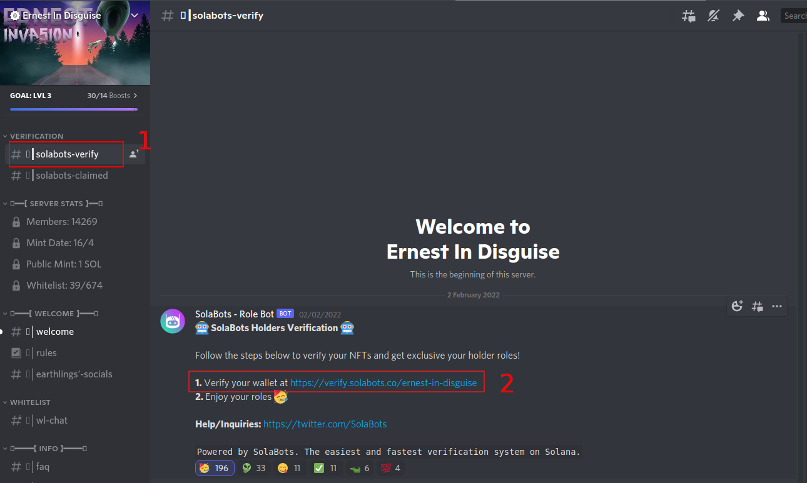  

### allow solabot  

authorize bot to access your username    

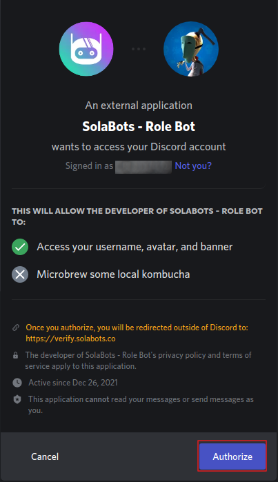  

### choose Ledger  

on the solabot website choose "Other / Ledger"  

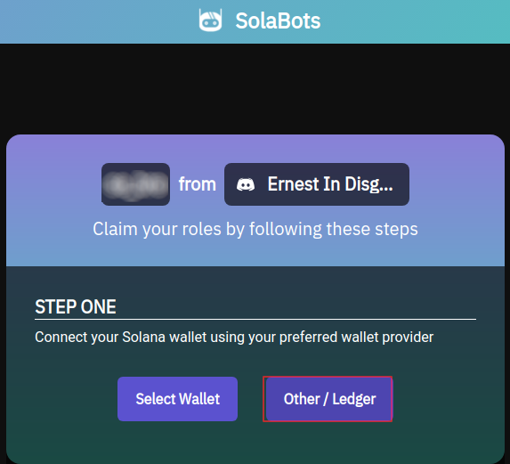  

### verification Transaction  

the solana app on Ledger can't sign messages at the moment. because of this you have to verify your ownership via a transaction  

in this example we use phantom wallet which is connected to our Ledger to do the transaction  
(1) enter the exact amount shown on the website to your transaction (send SOL - nothing else)  
(2) copy your own Solana address  
(3) paste your address and send the amount  

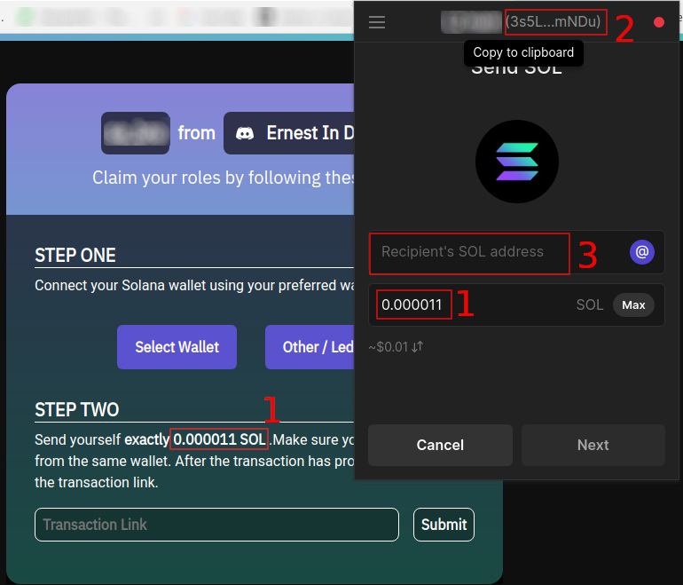  

**if you don't have this two buttons go to [known issues](#known-issues)**  

### get Tx to verify  

(1) select transaction history in phantom  
(2) klick on the transaction where you sent the amount from last step  

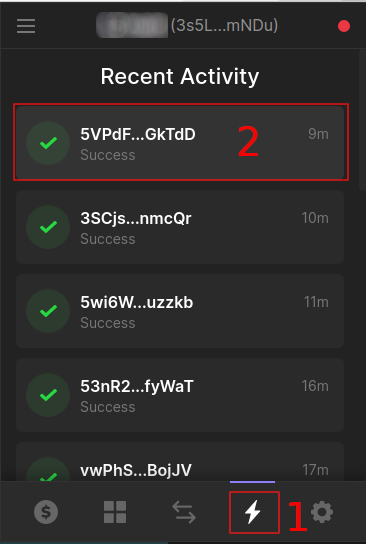  

### get Tx URL

copy the URL from your browser

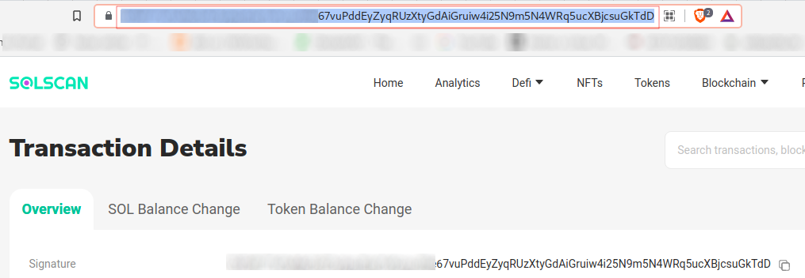  

### fill Tx URL in solabot form  

paste the URL you got in last step to the form on solabot website  

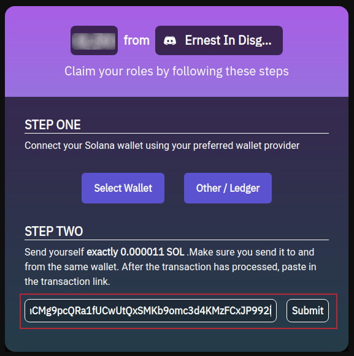  

### check your discord role  

follow all other steps in the discord verify channel  
the bot checks the wallets every hour. after a while check your roles in discord.  

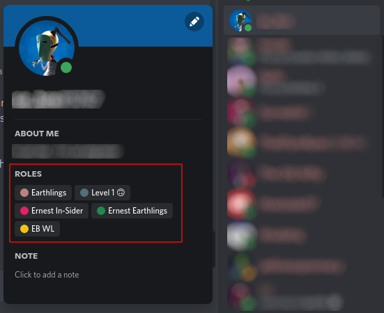   

---

## KNOWN ISSUES  

### cant choose Ledger on SolaBots website  

you can't select "Other / Ledger" on solabot website  

go to your user settings in your Discord app  
jump to "Authorized Apps"  
Deauthorize SolaBots  

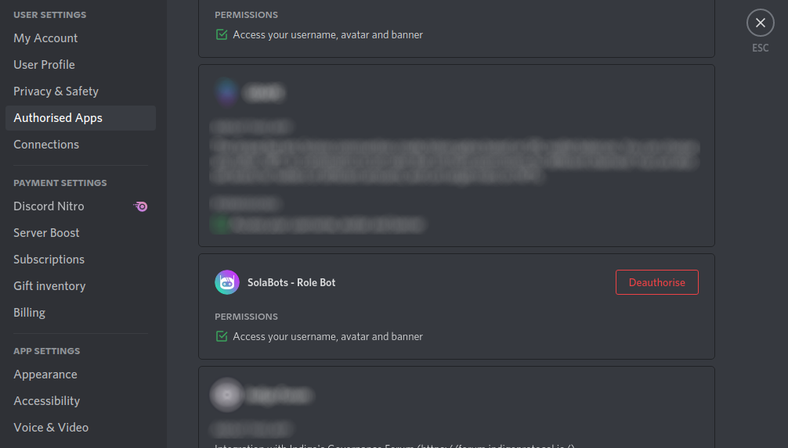  

remove the site access to your wallet  

open phantom and go to settings - "Trusted Apps"  

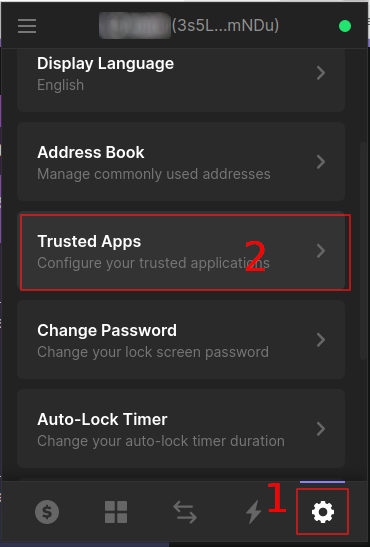  

revoke site access to your wallet  

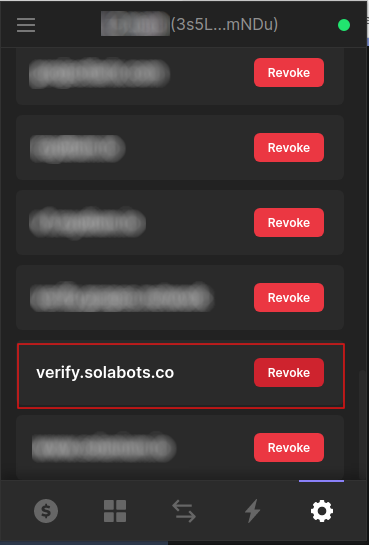

continue with [verify channel](#verify-channel)    

**HINT:** if this still don't work copy the solabot site URL and use a different browser - preferably one without a solana wallet plugin  

continue with [choose Ledger](#choose-ledger)  

### cant verify transaction  

check if the mint of the NFTs is still ongoing. In this case the json is not updated and the verification will not work.  
Wait for the mint to finish and try again to verify your transaction.  

---
